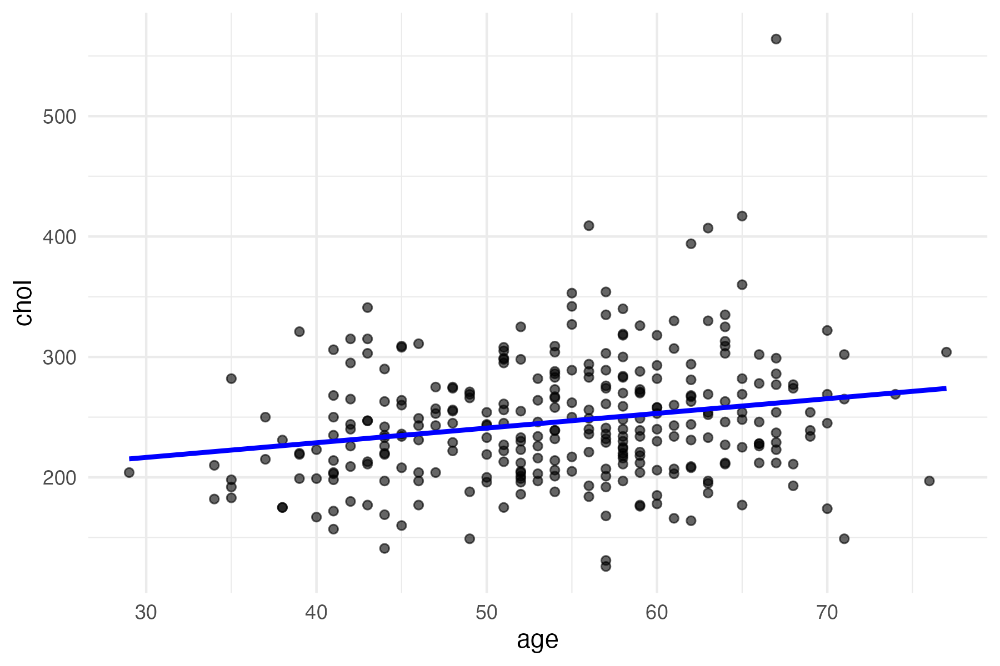

## Introduction
Cardiovascular disease is a leading cause of death worldwide. Identifying clinical indicators related to heart disease can support early diagnosis and improve treatment strategies.

This report analyzes a clinical dataset using logistic regression to model the probability of heart disease based on age, cholesterol level, and resting blood pressure. In addition to modeling, we explore the effects of sex and maximum heart rate on heart disease prevalence, and visualize key variable relationships.

---
```{r setup, include=FALSE}
heart_data <- read.csv("data/heart.csv", header = TRUE)
```

## Logistic Regression Results
The logistic regression model was fitted using age (age), cholesterol (chol), and resting blood pressure (trestbps) as predictors. The table below presents the estimated coefficients, standard errors, and p-values.
```{r}
summary_table <- read.csv("output/table.csv", row.names = 1)
knitr::kable(summary_table, digits = 3, caption = "Logistic Regression Coefficients")
```
## Visualization: Cholesterol vs. Age

The following scatterplot illustrates the relationship between age and cholesterol level. A trend line indicates that cholesterol tends to increase with age, though there is considerable variability.
```{r, echo=FALSE, out.width="70%"}

```

## Heart Disease by Gender
To explore gender differences in heart disease diagnosis, we examined the distribution of the outcome variable (target) by sex.

Among female patients (sex = 0), 75% were diagnosed with heart disease, whereas among male patients (sex = 1), only around 45% had heart disease. This suggests that women in this dataset had a higher rate of heart disease diagnoses.

```{r}
sex_table <- prop.table(table(heart_data$sex, heart_data$target), margin = 1)
knitr::kable(sex_table, digits = 2, caption = "Proportion of Heart Disease by Sex")
```

## Max Heart Rate by Heart Disease Status

We compared the average maximum heart rate (thalach) between patients with and without heart disease. Surprisingly, those with heart disease had a higher average max heart rate (≈158) than those without (≈139), which may indicate different physical response patterns.

```{r}
hr_table <- aggregate(thalach ~ target, data = heart_data, FUN = mean)
colnames(hr_table) <- c("Heart Disease", "Avg Max Heart Rate")
knitr::kable(hr_table, digits = 1, caption = "Average Max Heart Rate by Heart Disease Status")
```
## Conclusion

Our logistic regression model identified age, cholesterol, and resting blood pressure as relevant predictors of heart disease. Exploratory analysis revealed that:

Females in the dataset had a notably higher heart disease diagnosis rate than males.
Patients with heart disease showed higher average maximum heart rates.
These results highlight key patterns and suggest that multiple indicators—demographic and physiological—can provide insight into heart disease risk. Further research could explore interaction effects or use larger datasets for validation.
